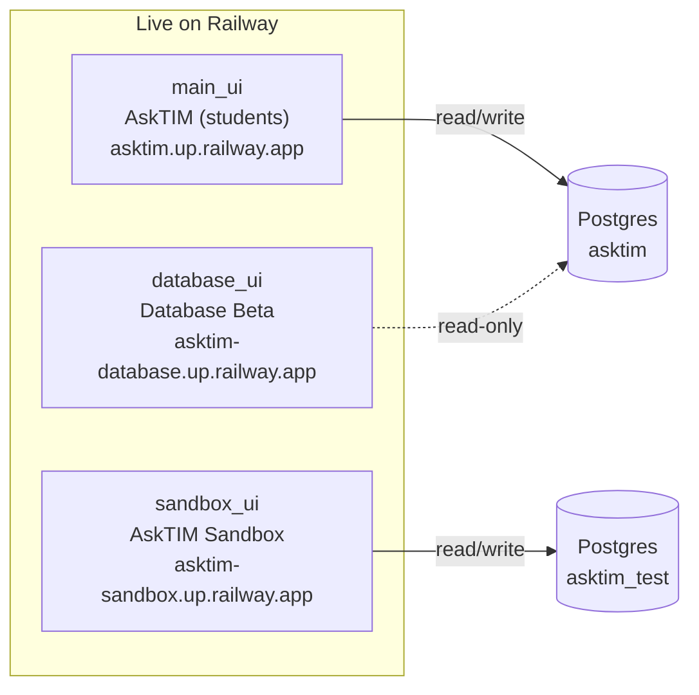
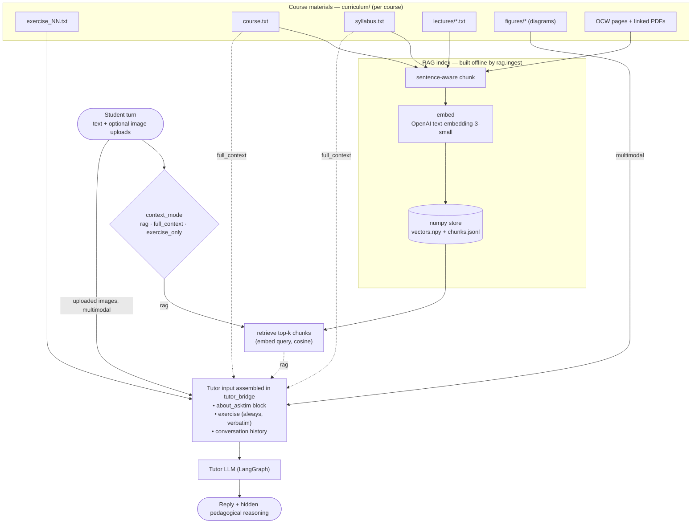
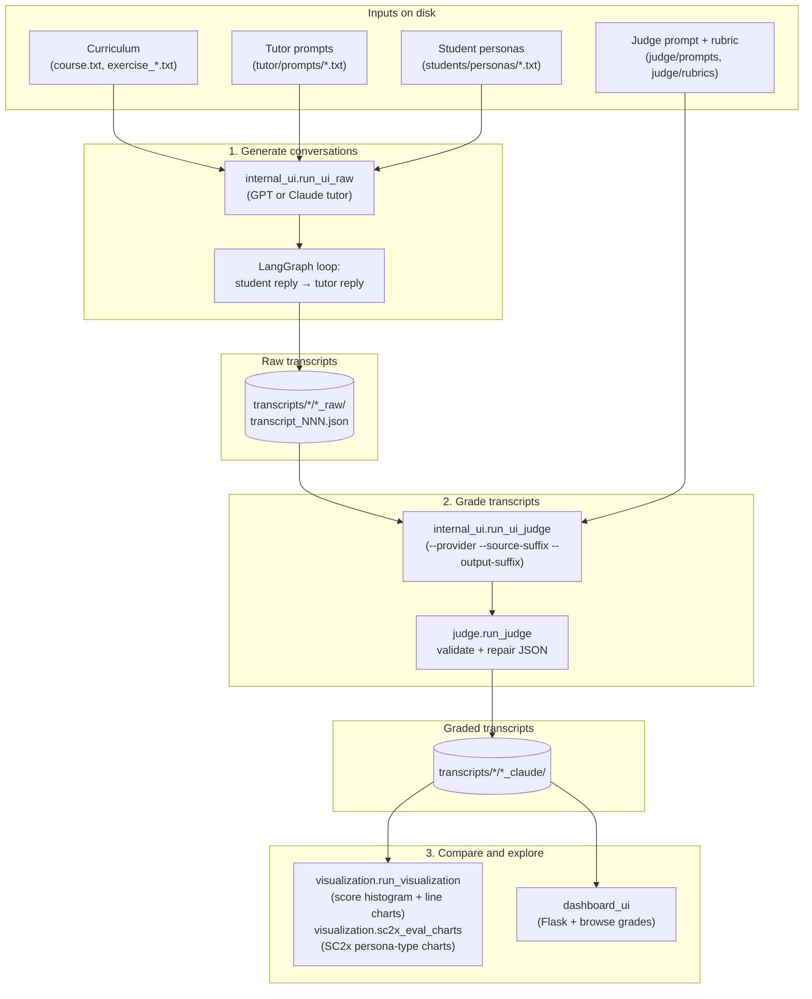

# AskTIM LLM Tutor Project

## Project Overview

### What I Built

I designed and built a **Socratic LLM tutor for MIT OpenCourseWare (OCW)** humanities and social sciences courses, intended as a deployable tool for students working through OCW assignments. The tutor is constrained to never give direct answers — it uses guided discovery, bite-sized responses, and formative feedback to walk students through assignments on topics like climate geography in urban studies, moral reflection in the humanities, or proof techniques in discrete math.

To evaluate and improve the tutor before deployment, I built a complete validation framework alongside it: adversarial AI student bots that each probe a specific failure mode (demanding answers under pressure, going off-topic, lecturing a lost student), an LLM judge that grades conversations against a structured rubric, and a visualization module that compares GPT and Claude judge scores across all transcripts. The dashboard lets me browse every conversation and its grades side-by-side.

The primary deliverable is now **AskTIM** — an iframe-embeddable chat app live for the Spring 2026 _MIT 11.270x Cities and Climate Change_ course. It wraps the same tutor pipeline in a Postgres-backed, identity-aware web app with token-streamed replies and cross-browser chat history. The student bots, judge, charts, and dashboard exist to stress-test the tutor systematically across different student personalities, courses, and difficulty levels before it reaches real learners.

### Why I Built It

- **Deployment goal:** Deliver a reliable Socratic tutor for OCW that guides students through humanities assignments without giving answers directly — working across the range of student types and engagement levels OCW sees in practice.
- **Validation goal:** Build a reproducible evaluation framework so tutor behaviour can be tested, graded, and compared across prompt versions before any version goes live.

## Technical Overview

### System Architecture

The system has six loosely coupled layers:

- **Conversation pipeline**: two LangGraph agents (tutor + student) trade messages in a structured multi-turn loop, each independently configurable via system prompt files
- **Judge pipeline**: a separate LangGraph agent reads a finished transcript and returns a structured JSON grade against a rubric, with up to 3 automatic repair-and-retry cycles
- **Dashboard + visualization**: a Flask web app for browsing the raw transcripts and their Claude judge grades (sortable score table + per-transcript conversation/grade view), and a matplotlib chart module (`visualization.run_visualization` for score histogram + per-transcript line charts; `visualization.sc2x_eval_charts` for SC2x persona-type breakdowns)
- **Student-facing app (`main_ui/`)**: iframe-embeddable chat for real OCW students, **live on Railway → [asktim.up.railway.app](https://asktim.up.railway.app/)**. PostgreSQL persistence (`asktim`), bcrypt-hashed username+password identity, Server-Sent Events streaming, sanitized-markdown tutor replies (tables/lists render cleanly), cross-browser conversation history. See [`main_ui/README.md`](main_ui/README.md).
- **Testing sandbox (`sandbox_ui/`)**: "AskTIM Sandbox" — a developer/TA chat app that mirrors `main_ui` but adds a step-by-step **Create context** wizard (custom course / exercise / tutor prompt / syllabus / lectures, plus a per-conversation RAG toggle). Its own PostgreSQL database (`asktim_test`) and teal-blue (`#126f9a`) branding keep it isolated from production. **Live on Railway → [asktim-sandbox.up.railway.app](https://asktim-sandbox.up.railway.app/)**. See [`sandbox_ui/README.md`](sandbox_ui/README.md).
- **Conversation review (`database_ui/`)**: read-only dashboard for browsing real `main_ui` conversations live from its Postgres — looks like `main_ui` (MIT crimson) but with no inputs, lists every conversation (most recent first, each labeled by student username), shows transcripts with tutor reasoning + uploaded images. Shared-password gated, strictly read-only. **Live on Railway → [asktim-database.up.railway.app](https://asktim-database.up.railway.app/)**. See [`database_ui/README.md`](database_ui/README.md) and [`database_ui/PLANNING.md`](database_ui/PLANNING.md).

### Live Deployments (Railway)

Three Flask services run in the `tutors (UW, humanities)` Railway project. The two
chat apps each own a Postgres database; the review dashboard reads `main_ui`'s
database read-only. (Click the app nodes to open the live sites.)



- **AskTIM** (students): <https://asktim.up.railway.app/>
- **AskTIM Sandbox** (developers/TAs): <https://asktim-sandbox.up.railway.app/>
- **AskTIM Database** (read-only review): <https://asktim-database.up.railway.app>

### Tutor Context Assembly (RAG + multimodal)

How context reaches the tutor on each student turn. Course materials are either
**baked into the prompt** (`full_context` mode) or **retrieved on demand** as
embedded chunks (`rag` mode, the default when a course has a built index); the
**exercise is always included verbatim**, and figures + student image uploads
ride along as multimodal content. `context_mode` (`rag` / `full_context` /
`exercise_only`) is resolved per conversation in `tutor_bridge`.



- **Always:** the about-AskTIM block + the exercise text (verbatim) + conversation history.
- **`full_context`:** `course.txt` and `syllabus.txt` are folded into the prompt.
- **`rag`:** course/syllabus/lectures/OCW are chunked + embedded offline (`rag.ingest`), and only the chunks most relevant to the student's message are retrieved and injected — far cheaper than dumping every transcript. See [`rag/README.md`](rag/README.md).
- **`exercise_only`:** just the about-block + exercise (no course/syllabus/retrieval).
- **Multimodal:** built-in curriculum figures and student-uploaded PNG/JPEGs attach to the turn as image content.

### Key Components

**Tutor Agent (`tutor/run_tutor.py`):** A LangGraph graph with a single node that calls GPT and returns a two-field JSON response — internal pedagogical reasoning (hidden from students) and a student-facing answer. The system prompt is loaded from a versioned `.txt` file and can be overridden with an assignment block at runtime.

**Student Bot (`students/run_student.py`):** Shares the same LangGraph infrastructure as the tutor, but uses a persona prompt from `students/personas/` to simulate a specific type of student. Includes a heuristic guard and automatic retry if the bot starts sounding like a tutor.

**Judge (`judge/run_judge.py`):** Reads a transcript, constructs a grading prompt by injecting the rubric and output schema, and calls the selected provider (`gpt` or `claude`). Validates the JSON response against the rubric spec, auto-repairs on failure up to 3 attempts, and writes the grade back into the transcript file. The latest rubric (`rubric_08`, 40 pts) scores three sections: Pedagogy (20 pts — Socratic method/no direct work, scaffolding, meta-learning), Dialogue Quality (12 pts — redundancy, assignment anchoring), and Communication Quality (8 pts — bite-sized responses, tone). (The earlier `rubric_05` was 46 pts and remains the in-code default.)

**UI Runners (`internal_ui/`):** Parallelized runners using `ThreadPoolExecutor` (default 6 workers) — raw transcript generation (`run_ui_raw`), mini-continuation generation (`run_ui_raw_mini`), transcript judging (`run_ui_judge`). Runners accept `--provider`, `--prompt`, `--rubric`, `--source-suffix`, `--output-suffix`, and `--yes` CLI flags as applicable.

**Dashboard (`dashboard_ui/`):** Flask app (port 5002) that discovers all raw transcripts on disk, attaches each one's Claude judge grade, and serves a sortable table (with a Score column) plus a per-transcript detail view (full conversation + grade panel) via a single-page JS frontend.

**Conversation review (`database_ui/`):** Read-only Flask dashboard (port 5003) for browsing real `main_ui` conversation data live from its Postgres, **deployed on Railway at <https://asktim-database.up.railway.app/>**. Looks like the `main_ui` chat (MIT-crimson) but with no composer/inputs — lists every conversation (most recent first, each labeled by student username), and renders a selected transcript with the tutor's pedagogical reasoning and uploaded images. Shared-password gated; strictly read-only (no schema writes). See [`database_ui/README.md`](database_ui/README.md).

**Student app (`main_ui/`):** Production-shape Flask app for the live OCW deployment. Streams tutor replies token-by-token via SSE while keeping the `pedagogical-reasoning` field hidden server-side. Persists conversations and messages to Postgres (Alembic-managed schema). Soft identity via a two-stage username + password modal that fires after the third student message — passwords are bcrypt-hashed in a separate `students` table, and the username cookie carries forward across browsers for chat-history continuity.

## Code in Action: Conversation Flow Example

### 1. Tutor Prompt (`tutor/prompts/tutor_05.txt`)

- Instructs the tutor to never state the answer directly
- Requires guided questions that move the student toward insights themselves
- Limits responses to one or two focused questions or observations per turn

### 2. Student Persona (`students/personas/chaotic_01.txt`)

- Simulates a student who pushes back against Socratic questioning
- Demands direct answers and complains the method is unhelpful
- Tests whether the tutor holds its role under social pressure

### 3. Resulting Conversation (`transcripts/chaotic/chaotic_raw/transcript_001.json`)

- Student opens by demanding the answer directly, refusing to engage
- Tutor deflects with a targeted question about the student's existing understanding
- Student reluctantly engages, making small correct steps each turn
- Tutor acknowledges progress and raises the next sub-question without giving away the conclusion

### 4. Judge Output (grade written back into the transcript JSON)

- Three sections scored: Pedagogy, Dialogue Quality, Communication Quality
- Per-criterion deductions include a sub-criterion ID, turn evidence, reason, and point value
- Total score, max score, overview paragraph, and full judge reasoning all recorded alongside the grade

## How the Workflow Runs

End-to-end flow from assignment content through simulation, judging, and analysis:



**1. Load prompts and build agents**

```python
system_prompt = load_system_prompt("tutor_05", assignment_override=assignment_text)
tutor_graph = create_tutor_graph(system_prompt)
student_graph = build_graph(prompt_name="chaotic_01")
```

**2. Run the multi-turn conversation loop**

```python
for turn_index in range(config.turn_size):
    student_msg = get_next_student_message(student_messages, graph=student_graph)
    tutor_messages, tutor_text = get_tutor_reply(tutor_messages, graph=tutor_graph)
```

**3. Save the raw transcript to disk**

```python
payload = {
    "tutor_prompt": "tutor_03", "student_persona": "chaotic_01",
    "course": "cities_and_climate_change", "exercise_number": "01",
    "exchanges": transcript_exchanges,
}
transcript_path.write_text(json.dumps(payload, indent=2))
```

**4. Grade the transcript with the judge**

```python
result = judge_transcript(
    "chaotic/chaotic_claude/transcript_001",
    provider="claude",
    prompt_name="judge_08",
    rubric_name="rubric_08",
)
print(result.total_score, result.max_score)  # e.g. 37, 40
```

**5. Generate score comparison charts**

```powershell
python -m visualization.run_visualization
# Output: visualization/outputs/claude_score_histogram_all.png,
#         claude_grades_all_transcripts.png, claude_grades_<persona>_transcripts.png
python -m visualization.sc2x_eval_charts
# Output: visualization/outputs/sc2x/01_total_by_persona_type.png (+ more)
```

## Project Structure & File Guide

### Directory Overview

```text
asktim_llm_tutor_project_2026/
│
├── curriculum/                     # course.txt + syllabus.txt + exercises/ + figures/ + optional lectures/ per course
│   ├── cities_and_climate_change/  # exercises/exercise_01..12.txt + figures/ (LIVE in AskTIM)
│   ├── intro_to_international_development_planning/  # exercises/exercise_01..24.txt (reflection prompts)
│   ├── mathematics_for_cs/         # exercises/exercise_01..10.txt (discrete math)
│   ├── physics_iii_vibrations_and_waves/  # exercises/exercise_01..10.txt
│   ├── meaning_of_life/            # exercises/exercise_01..03.txt (humanities reflection)
│   └── supply_chain_design/        # MIT CTL.SC2x — exercises/ + practices/ (source of current transcripts corpus)
│
├── students/
│   ├── run_student.py       # Shared LangGraph engine for all personas
│   └── personas/            # chaotic_01..06, cooperative_01..06, clueless_01..06
│
├── tutor/
│   ├── run_tutor.py         # LangGraph engine + prompt loading + response parsing
│   ├── run_tutor_mini.py    # Fork a raw transcript at a pivot turn with a new tutor
│   └── prompts/             # tutor_01.txt .. tutor_05.txt (versioned system prompts)
│
├── judge/
│   ├── run_judge.py         # Unified single-transcript judge (provider gpt/claude)
│   ├── hand_grade_workbook*.py  # Build/fill/rebuild the hand-grade calibration workbook
│   ├── prompts/             # judge_01.txt .. judge_08.txt (current default: judge_05)
│   └── rubrics/             # rubric_01.md .. rubric_08.md (latest: rubric_08, 40pt; in-code default: rubric_05)
│
├── internal_ui/
│   ├── run_ui_raw.py            # Generate raw transcripts in bulk (--output-suffix, --yes)
│   ├── run_ui_raw_mini.py       # Interactive wrapper for mini-continuation runs
│   ├── run_ui_raw_mini_batch.py # Batch mini-continuation over a reference transcript table
│   ├── run_ui_judge.py          # Grade transcripts (--provider, --source-suffix, --output-suffix, --yes)
│   └── cli_utils.py             # Shared interactive selection-prompt helpers
│
├── transcripts/             # Generated conversations, one folder per persona family.
│   │                        # Current corpus: SC2x with-lecture-context, tutor_05, 108 files each.
│   ├── chaotic/             # chaotic_raw/ (ungraded), chaotic_claude/ (Claude-graded)
│   ├── cooperative/         # cooperative_raw/, cooperative_claude/
│   └── clueless/            # clueless_raw/, clueless_claude/
│
├── dashboard_ui/
│   ├── run_dashboard_ui.py  # Flask app: routes, data loading, grade summaries
│   └── static/app.js        # Frontend: routing, sortable table, Chart.js histograms
│
├── Dockerfile_main          # Container for main_ui (Railway) — port 5001
├── Dockerfile_sandbox          # Container for sandbox_ui Sandbox (Railway)
├── Dockerfile_database        # Container for database_ui (Railway) — port 5003
├── Procfile                 # gunicorn main_ui.run_app:app
├── scripts/
│   ├── railway-entrypoint-main.sh    # main_ui: normalize DATABASE_URL, alembic upgrade, gunicorn
│   ├── railway-entrypoint-sandbox.sh    # sandbox_ui: normalize DATABASE_URL, create_all, gunicorn
│   └── railway-entrypoint-database.sh  # database_ui: require DATABASE_UI_PASSWORD, normalize URL, gunicorn (no migrations)
│
├── main_ui/                 # Student-facing AskTIM app (iframe-embed, Postgres `asktim`, SSE)
│   ├── run_app.py           # Flask factory; SSE /api/chat; identity routes
│   ├── db/                  # SQLAlchemy models + Alembic migrations
│   ├── routes/              # embed, chat (SSE), identity, history
│   ├── services/            # conversation persistence, students (bcrypt), tutor_bridge
│   ├── static/              # chat.css, chat.js (streaming consumer)
│   └── templates/embed.html # iframe-embeddable chat page
│
├── sandbox_ui/                 # AskTIM Sandbox: developer/TA chat, own Postgres `asktim_test`
│   ├── run_app.py           # Flask factory; create_all on boot (no Alembic)
│   ├── db/                  # models (adds syllabus_enabled + custom_* columns)
│   ├── routes/              # embed (+ /api/context/options, /preview), chat, identity, history
│   ├── services/            # conversation, students, tutor_bridge (custom-context aware)
│   ├── static/              # chat.css (#126f9a accent), chat.js (Edit/Create context)
│   └── templates/embed.html # chat page: Create context wizard
│
├── database_ui/               # Read-only conversation review dashboard (reads main_ui's Postgres)
│   ├── run_app.py           # Flask factory; read-only session, no create_all/migrations
│   ├── auth.py              # shared-password gate (DATABASE_UI_PASSWORD)
│   ├── db/                  # minimal read-only models (columns common to main_ui + sandbox_ui)
│   ├── routes/database.py     # list-all-conversations, transcript, image endpoints
│   ├── services/            # read-only conversation queries
│   ├── static/              # main_ui's chat.css + lean database.js (list + transcript)
│   ├── templates/           # index.html (sidebar + transcript), login.html
│   ├── README.md            # run/env/deploy notes
│   └── PLANNING.md          # design + implementation checklist
│
├── visualization/
│   ├── run_visualization.py # Score histogram + per-transcript line charts (all + per persona family)
│   └── sc2x_eval_charts.py  # SC2x persona-type breakdown charts (outputs/sc2x/)
│
└── utils/
    ├── parsing.py           # Shared JSON extraction helper
    ├── curriculum.py        # Canonical exercise/course path resolution (exercises/ layout)
    ├── figures.py           # Figure discovery + multimodal content blocks (GPT/Claude)
    └── lectures.py          # Per-course lecture-transcript loader
```

## Current Status

The full pipeline is working end-to-end, with:

- 3 persona families × 6 variants each (chaotic, cooperative, clueless) — 18 student personas total
- 6 courses: `cities_and_climate_change` (12 exercises, live in AskTIM), `intro_to_international_development_planning` (24), `mathematics_for_cs` (10), `physics_iii_vibrations_and_waves` (10), `meaning_of_life` (3), and `supply_chain_design` (MIT CTL.SC2x)
- Current on-disk transcript corpus: SC2x "with-lecture-context" run (course `supply_chain_design`, `tutor_05`) — each persona family has `*_raw/` (ungraded) and `*_claude/` (Claude-graded), 108 files each, 324 total
- Judge prompts versioned up to `judge_08`, rubrics up to `rubric_08` (latest/recommended: `judge_08` / `rubric_08`, **40 pts**; in-code default still `judge_05` / `rubric_05`). Claude is the primary judge; GPT judging paused.
- Dashboard browses every raw transcript with its Claude judge grade — a sortable table (with a Score column) and a per-transcript detail view (full conversation + grade panel), on port 5002
- Visualization outputs a score histogram plus per-transcript line charts (all personas + one per family) via `run_visualization`; the SC2x persona-type breakdown charts come from `sc2x_eval_charts` (`visualization/outputs/sc2x/`)
- **AskTIM (`main_ui/`)** is feature-complete through Step 10 (image uploads) — Postgres persistence, username + password identity, cross-browser history, SSE-streamed replies, and **student PNG/JPEG uploads** (stored in-DB, streamed to the tutor as multimodal input) — and is **live on Railway at <https://asktim.up.railway.app/>** (containerized, migrations run on boot). Steps 11–12 (multi-iframe test host, formal test suite) remain.
- **AskTIM Sandbox (`sandbox_ui/`)** is **live at <https://asktim-sandbox.up.railway.app/>** for developers/TAs — the same chat as `main_ui` plus a **Create context** wizard for one-off custom course/exercise/tutor/syllabus/lectures, on its own PostgreSQL database (`asktim_test`). Now also serves RAG-retrieved course context (with a per-conversation toggle).
- **Conversation review (`database_ui/`)** is **live on Railway at <https://asktim-database.up.railway.app/>** — a read-only dashboard that browses every real `main_ui` conversation live from its Postgres (most recent first, labeled by student username; transcript view with tutor reasoning + uploaded images), shared-password gated and strictly read-only. See [`database_ui/PLANNING.md`](database_ui/PLANNING.md).

## Challenges and How I Solved Them

- **Keeping the tutor in Socratic mode:** Getting GPT to never reveal answers required extensive prompt engineering. Added pedagogical reasoning as a separate JSON field so the model "thinks out loud" before answering, which consistently improves restraint.
- **Adversarial student bots that sound like tutors:** The student LangGraph node includes a heuristic that detects tutor-like phrasing (numbered agendas, coaching frameworks) and auto-retries with a correction message before returning the response.
- **LLM judge output validation:** Judge responses sometimes came back with float scores, missing fields, or malformed JSON. Built a multi-strategy extraction pipeline (raw JSON → fenced code block → brace extraction → `ast.literal_eval`) with up to 3 repair-and-retry cycles.
- **GPT vs Claude grade alignment:** Initial rubric versions produced high inter-judge variance. Migrating to `rubric_05` (simplified scoring, no malus deductions, mandatory sub-criterion IDs on deductions) measurably improved GPT/Claude correlation.
- **Inconsistent judge output schemas:** Different model versions and prompt iterations produced criteria in three different JSON shapes (flat keys, nested `criteria` dict, score under `base`). Built a normalization layer applied at write time and retroactively migrated all 927 graded transcripts with criterion data to a single canonical format.
- **Railway Postgres driver mismatch:** Railway hands out a bare `postgres://` / `postgresql://` connection string, which SQLAlchemy resolves to the psycopg2 driver — but the app ships psycopg3 only (`psycopg[binary]`), so both Alembic and the app crashed on boot with `ModuleNotFoundError: No module named 'psycopg2'`. Fixed it in the container entrypoint (`scripts/railway-entrypoint-main.sh`), which rewrites the scheme to the explicit `postgresql+psycopg://` before running migrations and starting gunicorn.

## Future Possibilities

- Additional student persona families and course subjects
- Human-in-the-loop evaluation to calibrate the LLM judge against human graders
- ML-assisted rubric refinement based on judge disagreement patterns
- Multimodal context is live: curriculum figures flow through the tutor/student/judge in batch runs (`utils/figures.py`, recorded in transcripts) **and through the live AskTIM/Sandbox chat** (auto-attached per exercise in `services/tutor_bridge.py`), per-course lecture transcripts (`utils/lectures.py`) fold into tutor context, and **students can upload PNG/JPEG images** in the AskTIM and Sandbox chat composers via paperclip, drag-and-drop, or clipboard paste (`utils/uploads.py`; stored in `uploaded_images.data`, streamed to the tutor as multimodal input). Remaining multimodal ideas: tutor-generated diagrams, and simulated-student image uploads
- End-of-course migration of the Railway-hosted AskTIM data to internal storage

## TL;DR

A Socratic LLM tutor built for MIT OpenCourseWare that guides students through humanities assignments using guided discovery and never gives answers directly—validated against simulated adversarial conversations, graded automatically by GPT & Claude judges across a structured rubric, and analyzed to measure judge consistency before deployment.

---

**Project Duration:** Winter 2025 — Present  
**Technologies:** Python, LangGraph, LangChain, OpenAI API, Anthropic API, Flask, gunicorn, SQLAlchemy + Alembic, PostgreSQL (psycopg3), bcrypt, Server-Sent Events, Chart.js, matplotlib, Docker, Railway, Git
